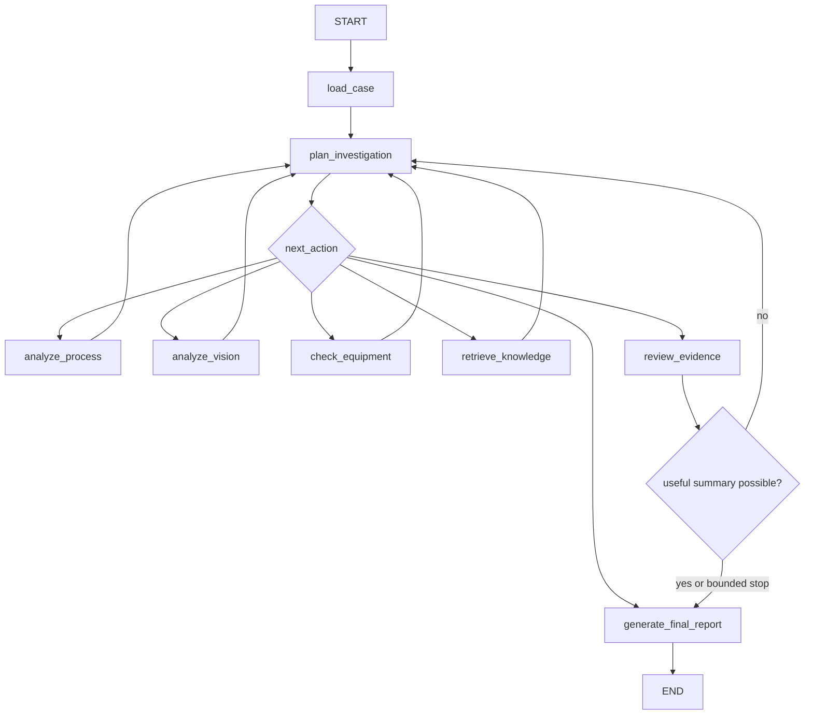

# FabSight v0.8 — LangGraph Investigation Agent

FabSight is an educational portfolio project using public and synthetic evidence. It contains no proprietary manufacturing data, confidential process recipes, private equipment configurations, or internal procedures.

## Agent concepts

An agent can choose actions based on its current state. LangGraph represents that behavior as nodes and edges around shared state. State is the accumulated case, evidence, plan, history, gaps, errors, and report. A node performs one focused task and returns a state update. An edge moves execution to another node; a conditional edge chooses the destination from state.

Loops let the agent collect another missing evidence type after review. They are bounded by `MAX_INVESTIGATION_ITERATIONS=6` so the agent always stops and writes a limited report. Completed or failed tools are tracked and are not unnecessarily repeated.

## Graph



The compiled implementation is an actual LangGraph `StateGraph`. `plan_investigation` and `review_evidence` use conditional edges; tool nodes loop through the planner.

## State and tools

`InvestigationState` retains the case ID and object, process/vision/equipment/knowledge evidence, structured plan, tool-call records, observations, hypotheses, gaps, conflicts, confidence, iteration count, trace, errors, final report, and provenance. List reducers accumulate trace, observations, tool history, and errors without duplicating the case.

Tools remain specialists:

- `analyze_process` wraps `ProcessPredictor` or reads its already-recorded case output.
- `analyze_wafer` wraps `WaferPredictor` or reads its already-recorded case output.
- `get_equipment_context` queries the case's synthetic fab context.
- `retrieve_knowledge` wraps `KnowledgeRetriever`.
- `grounded_explanation` reuses the v0.7 `RAGChain` near finalization.

The LLM is an optional structured planner and final evidence synthesizer. It does not replace predictors, table queries, or retrieval. Hundreds of raw anonymous variables are never sent for physical interpretation.

## Planning and reliability

Planner output has three required fields: `next_action`, `reason`, and `missing_evidence`. Actions are restricted to `ANALYZE_PROCESS`, `ANALYZE_VISION`, `CHECK_EQUIPMENT`, `RETRIEVE_KNOWLEDGE`, `REVIEW_EVIDENCE`, and `FINALIZE`. Invalid LLM output gets one retry. The deterministic fallback selects the first unattempted missing evidence tool, reviews when evidence is present, or finalizes with limitations when unavailable tools have already been attempted.

LLM planning is flexible; deterministic fallback makes routing reliable. The default CLI uses deterministic planning to avoid spending several API requests just to choose obvious missing evidence. Gemini is used once for grounded final synthesis.

Every tool call records its name, safe input summary, UTC timestamp, success, and compact output summary. Secrets and environment variables are never logged. A tool failure becomes an error and missing-evidence limitation rather than automatically terminating the graph.

## Evidence and reports

Evidence sufficiency means enough information exists for a useful summary—not that a cause is scientifically proven. LOW process risk paired with a strong visual defect, or HIGH risk paired with no visual pattern, is preserved as an explicit conflict.

Hypotheses are always labeled `HYPOTHESIS`, retain `DERIVED` provenance, cite supporting evidence, include confidence, and state limitations. Reports never contain a confirmed-root-cause section.

Run:

```powershell
python scripts/investigate_case.py --case CASE-00042
python scripts/investigate_case.py --case CASE-00042 --verbose
python scripts/evaluate_agent.py
```

v0.7 was a fixed retrieve-then-generate workflow. v0.8 is state-aware dynamic routing: the next operation depends on accumulated evidence. There is still no checkpoint persistence, human interrupt, long-term memory, named causal telemetry, autonomous causal simulator, API, dashboard, or deployment framework.

## Architectural progression

```text
v0.1 synthetic fab → v0.2 process dataset → v0.3 process ML
→ v0.4 wafer vision → v0.5 multimodal cases → v0.6 retrieval
→ v0.7 full RAG → v0.8 LangGraph investigation agent
```
